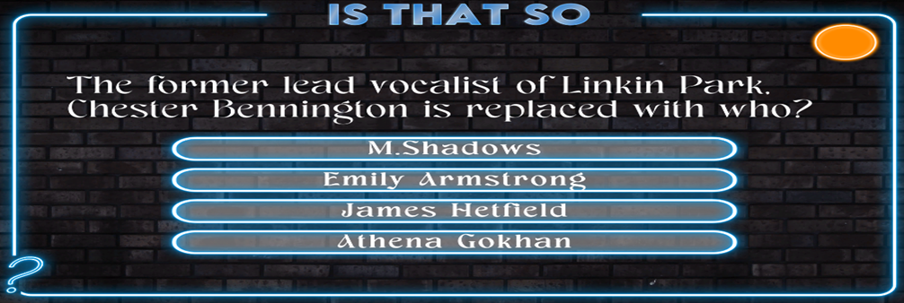

# is-that-so
A quiz game with special questions. - still working on

**My Experiences:**
My latest project is a quiz game, designed specifically to enhance my skills in user interface (UI) development within Unity. Unlike my previous games, this project primarily emphasizes creating an intuitive and visually appealing UI experience.

For this game, I sourced and customized assets to suit the quiz's engaging style. I developed an interactive layout featuring four answer buttons and a dedicated area for questions. To add variety and replayability, I implemented a system that randomly selects questions from separate question scripts prepared within Unity, each containing four possible answers. Correct answers were managed using indexed references, allowing smooth and accurate answer validation. Given the diverse range of questions, the game functions effectively as a general knowledge quiz, offering both educational value and entertainment.

A key feature of the game is its timing system. Each question has a designated response time, enhancing the game's pace and challenge. Additionally, a separate timer indicates the correct answer if the player makes an incorrect selection. To streamline development and ensure consistency, I designed answer buttons as prefabs, equipped with onClick components that visually indicate correct or incorrect selections through color changes.

Within the game's scripting, the questionSO script includes methods such as getQuestion and getAnswer, facilitating efficient question management. The main quiz script incorporates features to disable further selections after a choice is made, ensuring clarity in gameplay. Answer buttons dynamically pull content from the UI, maintaining a cohesive player experience. Moreover, the timer script provides visual feedback through a circular timer, adjusting fill speed and duration based on game scenarios.

This project significantly contributed to my understanding of UI design and interaction mechanics, marking an important step in diversifying and strengthening my game development capabilities.

